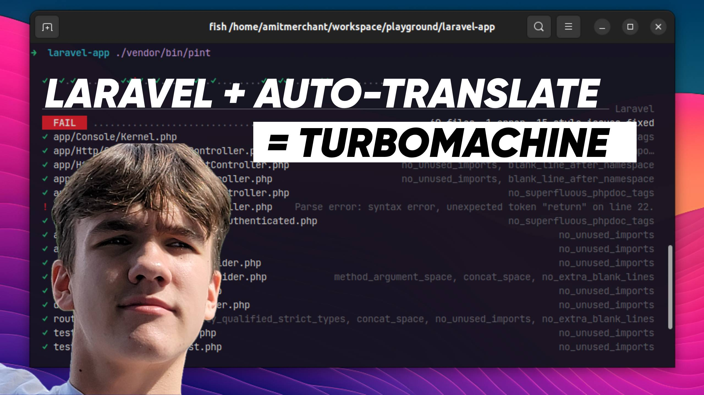

# Laravel Files Translator

**Files Translator for Laravel** - is a package designed to streamline the process of extracting and translating text content from Blade or HTML files in your Laravel applications.

---

## Installation

Run the following command in your Laravel project directory:

```bash
composer require mishalestev/laravel-files-translator
```

---

If you're unsure how this package works, please watch our short introductory video:

[](https://youtu.be/IsiUgIftRiw)

Under 10 minutes [✅ https://youtu.be/IsiUgIftRiw](https://youtu.be/IsiUgIftRiw)

---

### Example Use Case

Suppose you have a file with the following text (that is the 4th commandement):

```html
<div class="text-base text-black">Remember the sabbath day, to keep it holy.</div>
<div class="text-base text-black">Six days shalt thou labour, and do all thy work:</div>
<div class="text-base text-black">But the seventh day is the sabbath of the Lord thy God:</div>
<div class="text-base text-black">in it thou shalt not do any work, thou, nor thy son,</div>
<div class="text-base text-black">nor thy daughter, thy manservant, nor thy maidservant,</div>
<div class="text-base text-black">nor thy cattle, nor thy stranger that is within thy gates:</div>
<div class="text-base text-black">For in six days the Lord made heaven and earth,</div>
<div class="text-base text-black">the sea, and all that in them is, and rested the seventh day:</div>
<div class="text-base text-black">wherefore the Lord blessed the sabbath day, and hallowed it.</div>
```

To translate this content into Spanish, run the following command:

```bash
php artisan translate:file --lang=es --input=resources/views/commandments.blade.php --output=lang/en/commandments.php
```

This command will:

1. **Generate a Translated Blade File:**  
   It creates a new Blade file with the text replaced by `__()` translation calls. This file uses unique keys mapped to text segments, due to maintenance considerations.

2. **Produce Corresponding Translation Files:**  
   It generates translation files within your `lang/` directory. You get both the source language and the target language files populated with key-value pairs, mapping each text snippet to its translation.

---

### Resulting Files

**Translated Blade File:**

_`resources/views/commandment_translated.blade.php`_

```html
<!DOCTYPE html>
<html lang="en">
<head><meta charset="UTF-8"></head>
<body>
   <div class="text-base text-black">{{ __('commandement.key_217762278049d3017bfd946d250bd8c1') }}</div>
   <div class="text-base text-black">{{ __('commandement.key_1eeafa582e3c49562668d54bb368c58e') }}</div>
   <div class="text-base text-black">{{ __('commandement.key_3238a9234abe3dcd02238d0d8b5c1fb5') }}</div>
   <div class="text-base text-black">{{ __('commandement.key_8381b742e34b685e1a0cfb81867efb98') }}</div>
   <div class="text-base text-black">{{ __('commandement.key_730695692e7cfd2b1470e572af9d8644') }}</div>
   <div class="text-base text-black">{{ __('commandement.key_a6c36c16f68a094a27ae3e2177911d6c') }}</div>
   <div class="text-base text-black">{{ __('commandement.key_236abf8e864840c6277606a1254e7b35') }}</div>
   <div class="text-base text-black">{{ __('commandement.key_346637a025ad4a8655361a22322999bc') }}</div>
   <div class="text-base text-black">{{ __('commandement.key_ec75f0ccfa23369829f182a6a3cb0e31') }}</div>
</body>
</html>
```

**Translation Files:**

_`lang/es/commandement.php`_

```php
<?php

declare(strict_types=1);

return [
"key_217762278049d3017bfd946d250bd8c1" => <<<TEXT
Acordaos del día de reposo para santificarlo.
TEXT,
"key_1eeafa582e3c49562668d54bb368c58e" => <<<TEXT
Seis días trabajarás y harás toda tu obra.
TEXT,
"key_3238a9234abe3dcd02238d0d8b5c1fb5" => <<<TEXT
Pero el séptimo día es sábado para Jehová tu Dios:
TEXT,
"key_8381b742e34b685e1a0cfb81867efb98" => <<<TEXT
en él no harás ningún trabajo, ni tú ni tu hijo,
TEXT,
"key_730695692e7cfd2b1470e572af9d8644" => <<<TEXT
ni tu hija, ni tu siervo, ni tu sierva,
TEXT,
"key_a6c36c16f68a094a27ae3e2177911d6c" => <<<TEXT
ni tu ganado, ni tu extranjero que está dentro de tus puertas:
TEXT,
"key_236abf8e864840c6277606a1254e7b35" => <<<TEXT
Porque en seis días hizo el Señor los cielos y la tierra,
TEXT,
"key_346637a025ad4a8655361a22322999bc" => <<<TEXT
el mar, y todo lo que en ellos hay, y descansó el séptimo día:
TEXT,
"key_ec75f0ccfa23369829f182a6a3cb0e31" => <<<TEXT
Por tanto, el Señor bendijo el día del sábado y lo santificó.
TEXT,
];
```

_`lang/en/commandement.php`_

```php
<?php

declare(strict_types=1);

return [
"key_217762278049d3017bfd946d250bd8c1" => <<<TEXT
Remember the sabbath day, to keep it holy.
TEXT,
"key_1eeafa582e3c49562668d54bb368c58e" => <<<TEXT
Six days shalt thou labour, and do all thy work:
TEXT,
"key_3238a9234abe3dcd02238d0d8b5c1fb5" => <<<TEXT
But the seventh day is the sabbath of the Lord thy God:
TEXT,
"key_8381b742e34b685e1a0cfb81867efb98" => <<<TEXT
in it thou shalt not do any work, thou, nor thy son,
TEXT,
"key_730695692e7cfd2b1470e572af9d8644" => <<<TEXT
nor thy daughter, thy manservant, nor thy maidservant,
TEXT,
"key_a6c36c16f68a094a27ae3e2177911d6c" => <<<TEXT
nor thy cattle, nor thy stranger that is within thy gates:
TEXT,
"key_236abf8e864840c6277606a1254e7b35" => <<<TEXT
For in six days the Lord made heaven and earth,
TEXT,
"key_346637a025ad4a8655361a22322999bc" => <<<TEXT
the sea, and all that in them is, and rested the seventh day:
TEXT,
"key_ec75f0ccfa23369829f182a6a3cb0e31" => <<<TEXT
wherefore the Lord blessed the sabbath day, and hallowed it.
TEXT,
];
```

## Process In More Details

1. **It Generates a Translated File:**  
   After processing your specified input file (Blade or HTML), the package produces a new, translated file (`_translated.blade.php`) in the same directory. This file has all the original plain text replaced by their translated equivalents.

2. **Creates Corresponding Translation Files:**  
   The package will generate language directories under `lang/` for both the source language and the target language(s). Inside these directories, it will create translation files to store your translations. For example:
   ```bash
   lang/
   ├── en/
   │   └── welcome.php   # English version of the welcome page
   └── es/
       └── welcome.php   # Spanish version of the welcome page
   ```

## Example Usage

1. **Create a New Laravel Project (if needed):**  
   If you don't already have a Laravel project, create one using the following command:
   ```bash
   composer create-project laravel/laravel ./
   ```

2. **Run the Translation Command:**  
   Use the Artisan command provided by the package to process and translate your Blade or HTML files.  
   For example:
   ```bash
   php artisan translate:file --lang=es --input=resources/views/welcome.blade.php --output=lang/en/welcome.php
   ```
   - Replace `es` with the desired target language code.
   - Specify the input file path and the output translation file path as required.

3. **Update Application Locale (Optional):**  
   Open `config/app.php` and modify the locale configuration as follows:
   ```php
   // Replace this line:
   // 'locale' => env('APP_LOCALE', 'en'),

   // With this:
   'locale' => 'es', // or any language you choose
   ```

4. **Serve Your Application:**  
   Run the Laravel development server to test the changes:
   ```bash
   php artisan serve
   ```

   Open your application in a browser to see the translations in action.

---

## Artisan Command Signature

The package provides a customizable Artisan command:

```php
protected $signature = 'translate:file 
                        {--lang=en : The target language for translations} 
                        {--input= : Path to the Blade or HTML file to process} 
                        {--output= : Path to the translation file to generate}
                        {--force : Overwrite the input file with translated text if Blade directives are already commented}';
```

---

## Future Objectives & Roadmap

As we continue to develop and enhance the Laravel Files Translator package, here are several objectives and enhancements we plan to implement:

1. **Preserving Blade Directives:**  
   Currently, the package removes all Blade directives. We aim to support the preservation of these directives in future releases, eliminating the need to manually re-insert them.

> [!NOTE]
> 2. **~File Replacement or New File Creation~ (Implemented)**  
> We plan to introduce an option to replace the original file, akin to using a `--force` flag in Git. This feature will complement the existing functionality that creates a new file with a `_translated.blade.php` suffix.

3. **Custom Output Directories:**  
   Future versions may include a feature to specify a custom output directory (e.g., `built/`) for storing compiled files, translations, and Blade templates post-translation. This will let developers manually distribute files within a project (if applicable).

4. **Route-Based Language Switcher:**  
   We're considering the addition of a feature to automatically set up a language switcher in `routes/web.php`, which will allow for quick testing and demonstration of different localizations.

5. **JSON Translation Support:**  
   In addition to the default PHP array files, we plan to support the generation of JSON-based translation files, providing more flexibility in how translations are stored and used.

6. **Whitespace & Formatting Preservation:**  
   Currently logic for handling spacing and indentation, particularly for nested elements, is needed. It has to retain space formatting of the translated files.

7. **Multiple Languages Support:**  
   Builed a multiple language support (e.g., `--lang=en,es,fr`) in a single command, generating multiple sets of translated files simultaneously.

8. **Shortening Translation Keys:**  
   We are looking for options to shorten the keys generated for translation entries, currently based on an MD5 algorithm, to make them more manageable.

9. **Handling Non-Native HTML Tags:**  
   Plans include developing methods to recognize and correctly handle non-native HTML tags, which are currently not supported.

10. **Duplicate Text Optimization:**  
   If the text is the same across the file, the system should reuse existing keys instead of generating new ones.

11. **Community-Driven Features:**  
   We actively encourage the community to contribute ideas and improvements. Please submit issues or pull requests on GitHub for any features you'd like to see incorporated or enhanced.

Your feedback and contributions help us make this tool better for everyone.

## For More Information

If you have any questions or need support, feel free to reach out via email:  
**[lestev.mi@gmail.com](mailto:lestev.mi@gmail.com)**

---

## Credits

This project is built using the following open-source projects:

- **[Laravel](https://github.com/laravel)** – The foundation for building web applications.
- **[Stichoza\GoogleTranslate\GoogleTranslate](https://github.com/Stichoza/google-translate-php)** – A robust tool for translating text.

Thanks for their outstanding work.

---

## To Support

The greatest support you may offer is to read this [book](https://m.egwwritings.org/en/book/130.4).

Whether you read it or not is your choise, and I respect it.